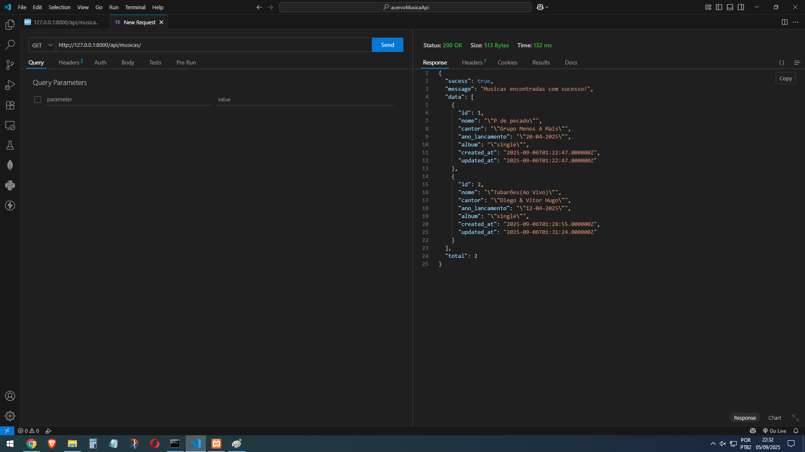
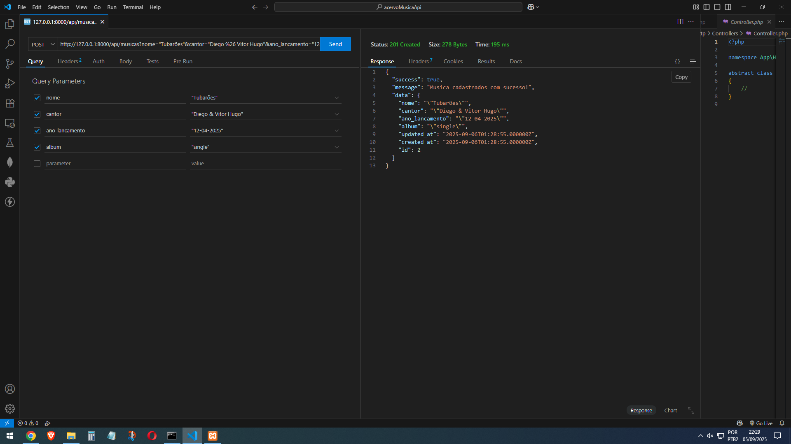
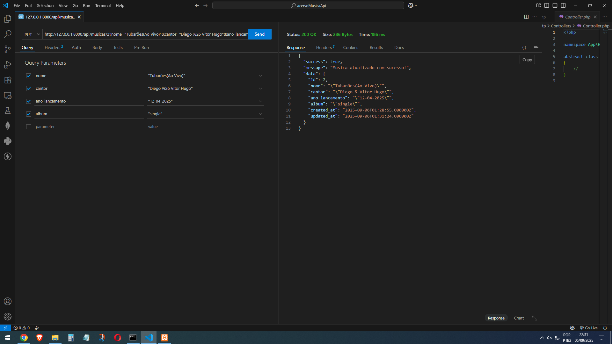
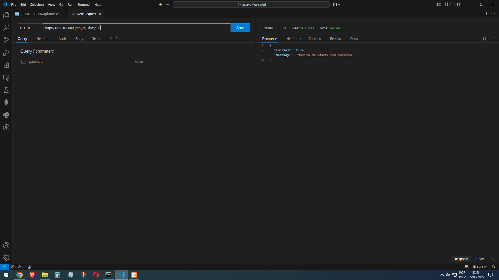

## Api de acervo de musicas

Api criado em sala de aula no curso de desenvolvimento de sistemas na escola ETEC Guarulhos

O Api faz parte de um exercicio de criacao de Api usando laravel

Abaixo os prints do métodos de http funcionando'

- Método Get

- Método Post

- Método Put

- Método Delete
